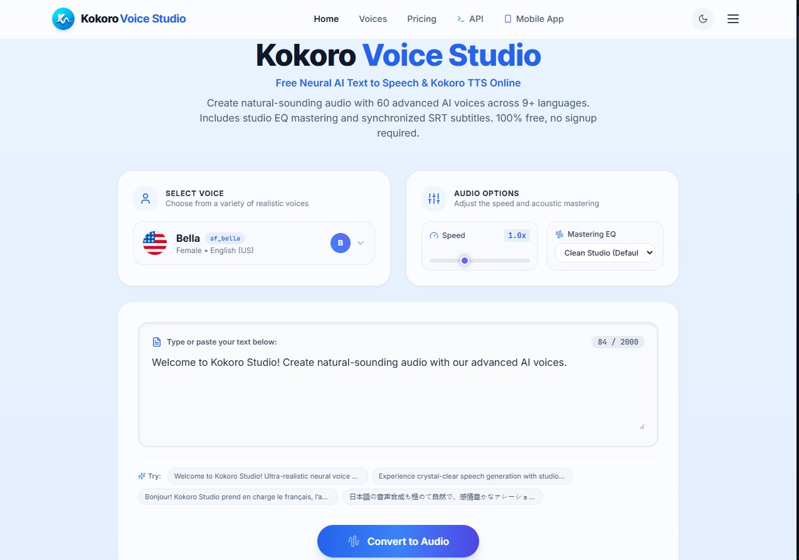

# 🎙️ Kokoro Voice Studio — Free Neural AI Text-to-Speech & Kokoro TTS Workstation

<div align="center">

[](https://saytts.site)
[](https://huggingface.co/hexgrad/Kokoro-82M)
[](#-supported-languages--voices)
[](LICENSE)
[](https://pagespeed.web.dev/analysis?url=https%3A%2F%2Fsaytts.site%2F)

### **Open-Source Neural Speech Synthesis, Audio Mastering & Subtitle Workstation**
*Generate ultra-realistic AI voiceovers in your browser, self-host with Docker, or integrate via REST API. Zero login required.*

### 🔗 **[Try the Official Live Web App: https://saytts.site](https://saytts.site)**

<br />

<p align="center">
  
</p>

</div>

---

## 🌟 Overview

**Kokoro Voice Studio (SayTTS)** is an open-source, studio-grade AI Text-to-Speech (TTS) workstation and developer API powered by the lightweight **Kokoro-82M ONNX** neural model and an advanced **Multilingual G2P (Grapheme-to-Phoneme)** phonetic engine.

Designed for content creators, video editors, podcasters, game developers, and software engineers, Kokoro Voice Studio delivers human-like speech synthesis faster than real-time on commodity CPUs without requiring expensive GPUs or third-party cloud API keys.

Whether you need broadcast-quality voiceovers for YouTube and TikTok, synchronized `.srt` subtitle files for video editing software, or a self-hosted OpenAI-compatible TTS endpoint for AI agent frameworks, Kokoro Voice Studio provides a complete, friction-free audio production environment.

### 🔗 Online Web Experience: SayTTS
The official cloud-hosted version of this project is live at **[saytts.site](https://saytts.site)**. It offers immediate web access across desktop and mobile devices with generous free monthly character quotas, instant audio playback, and zero registration or sign-in friction.

---

## ✨ Key Features

### 🎙️ Neural Voice Generation
* **Kokoro-82M ONNX Engine**: Powered by 82 million parameter neural weights with INT8 quantization, enabling sub-200 millisecond voice generation directly on CPU.
* **60+ Character & Regional Voices**: Rich emotional inflections and varied vocal timbres across English, Japanese, French, Korean, Mandarin, Spanish, Hindi, Italian, and Brazilian Portuguese.
* **Neural Voice Blender**: Mathematically interpolate and blend any two voice embeddings at custom percentage ratios to design unique hybrid vocal identities.

### 🎛️ Acoustic Studio Mastering
* **Professional EQ Presets**: Built-in digital biquad filter bands for audio post-processing (Warm Podcast Host, Deep Cinematic Trailer, Radio Broadcast, Crisp Commercial Air, Vintage Tube Warmth).
* **High-Fidelity Audio Formats**: Studio-quality 24kHz audio in MP3 and uncompressed WAV formats.

### 📜 Synchronized Subtitles (SRT & VTT)
* **Automatic Subtitle Generation**: Automatically produces frame-accurate SubRip (`.srt`) and WebVTT (`.vtt`) files alongside synthesized speech.
* **Video Editor Compatibility**: Drop subtitle files directly into CapCut, Adobe Premiere Pro, DaVinci Resolve, and Final Cut Pro without manual transcription.

### 🔌 Developer & API Integration
* **OpenAI-Compatible REST API**: Drop-in replacement for `/v1/audio/speech`, compatible with existing OpenAI SDKs, LangChain, AutoGen, and CrewAI pipelines.
* **Native High-Throughput Endpoints**: Direct `/api/tts` and `/render` endpoints returning audio files, Base64 audio buffers, and timestamped subtitle data.
* **Self-Hostable**: Simple single-command Docker deployment for Linux servers, macOS, and Windows.

---

## 🌍 Supported Languages & Voices

| Flag | Language / Accent | Code | Voices | Sample Personalities & Characters |
| :---: | :--- | :---: | :---: | :--- |
| 🇺🇸 | **English (US)** | `en-us` | **20 voices** | Bella, Adam, Heart, Echo, Nicole, Sarah, Sky, Michael, Emma, Santa |
| 🇬🇧 | **English (UK)** | `en-gb` | **8 voices** | George, Lewis, Emma, Daniel, Alice, Isabella, Lily, Fable |
| 🇫🇷 | **French** | `fr-fr` | **5 voices** | Siwis, Alexandre, Lucas, Camille, Juliette |
| 🇯🇵 | **Japanese** | `ja` | **5 voices** | Alpha (アルファ), Gongitsune, Nezumi, Kumo, Sora |
| 🇰🇷 | **Korean** | `ko` | **2 voices** | Minji (민지), Junho (준호) |
| 🇨🇳 | **Mandarin Chinese** | `cmn` | **8 voices** | Xiaobei (小北), Xiaoxiao (小小), Yunxi (云希), Yunjian |
| 🇪🇸 | **Spanish** | `es` | **3 voices** | Dora, Alex, Papá Noel |
| 🇮🇳 | **Hindi** | `hi` | **4 voices** | Alpha (अल्फा), Beta, Omega, Psi |
| 🇮🇹 | **Italian** | `it` | **2 voices** | Sara, Nicola |
| 🇧🇷 | **Portuguese (BR)** | `pt-br` | **3 voices** | Dora (BR), Alex (BR), Papai Noel |

---

## 🖥️ Live Web App vs Self-Hosted

| Feature | Live Web App ([saytts.site](https://saytts.site)) | Self-Hosted / Docker | Desktop App (Local) |
| :--- | :---: | :---: | :---: |
| **Setup Time** | Instant (0 sec) | 2 minutes | 3 minutes |
| **Hardware Required** | Any browser / phone | Any x86_64 / ARM server | Local Windows / Linux / macOS PC |
| **GPU Required** | No | No (CPU-accelerated) | No |
| **Offline Support** | No (Cloud CDN) | Intranet / Localhost | 100% Offline |
| **API Endpoint** | Optional | Full REST API | CLI / Local GUI |
| **Mastering EQ** | Included | Included | Included |
| **SRT Subtitles** | Included | Included | Included |

---

## 🚀 Quick Start & Installation

### Option 1: Live Web Application
Visit **[https://saytts.site](https://saytts.site)** directly in your browser.

---

### Option 2: Docker Deployment (Recommended for Servers)

Run Kokoro Voice Studio on any Linux VPS or server with a single Docker command:

```bash
# Clone the repository
git clone https://github.com/dilshan916/kokoro-voice-studio.git
cd kokoro-voice-studio

# Build and run with Docker
docker build -t kokoro-voice-studio .
docker run -d -p 8000:8000 --name saytts kokoro-voice-studio
```

Open `http://localhost:8000` in your browser. The Docker container automatically downloads the ONNX model weights and voice dictionaries on first boot.

---

### Option 3: Local Python & Frontend Development

#### 1. Prerequisites
* **Python 3.10+**
* **Node.js 18+** & `npm`
* **eSpeak-NG** (for international phonemization)
  * Windows: `winget install espeak-ng` or download MSI installer
  * Ubuntu / Debian: `sudo apt-get install -y espeak-ng`
  * macOS: `brew install espeak-ng`

#### 2. Backend Setup
```bash
# Clone repository
git clone https://github.com/dilshan916/kokoro-voice-studio.git
cd kokoro-voice-studio

# Install Python dependencies
pip install -r requirements.txt

# Start the FastAPI audio synthesis backend
python server.py
```
*The backend automatically downloads the ONNX model files from GitHub releases if not present locally.*

#### 3. Frontend Setup
```bash
cd frontend
npm install
npm run dev
```
Open `http://localhost:5173` to access the hot-reloading development workspace.

---

## 🔌 REST API Documentation

Kokoro Voice Studio exposes high-throughput REST endpoints compatible with the OpenAI Audio API specification as well as native workstation endpoints.

### 1. OpenAI-Compatible Endpoint: `POST /v1/audio/speech`

Integrate Kokoro TTS directly into any OpenAI client library by configuring `base_url`.

#### Endpoint Details:
* **URL**: `https://saytts.site/v1/audio/speech` (or `http://localhost:8000/v1/audio/speech`)
* **Method**: `POST`
* **Content-Type**: `application/json`

#### Request Parameters:

| Parameter | Type | Required | Default | Description |
| :--- | :---: | :---: | :---: | :--- |
| `input` | string | Yes | — | Text to synthesize into speech. |
| `voice` | string | No | `af_bella` | Voice ID from the catalog (e.g. `af_bella`, `am_adam`, `jf_alpha`). |
| `model` | string | No | `kokoro` | Model identifier (`kokoro`, `kokoro-82m`, `tts-1`). |
| `response_format` | string | No | `mp3` | Output audio format: `mp3`, `wav`, `flac`, `aac`, `opus`. |
| `speed` | float | No | `1.0` | Speech playback rate multiplier (`0.5` to `2.0`). |
| `eq_preset` | string | No | `Clean Studio (Default)` | Acoustic mastering preset name. |
| `lang` | string | No | `auto` | Language override code (e.g. `en-us`, `ja`, `fr-fr`, `cmn`). |

#### Example `curl` Request:
```bash
curl -X POST https://saytts.site/v1/audio/speech \
  -H "Content-Type: application/json" \
  -d '{
    "input": "Welcome to Kokoro Voice Studio. This speech was synthesized using Kokoro-82M ONNX.",
    "voice": "af_bella",
    "response_format": "mp3",
    "speed": 1.0,
    "eq_preset": "Warm Podcast Host (+Bass)"
  }' \
  --output speech.mp3
```

#### Example Python Request:
```python
import requests

url = "https://saytts.site/v1/audio/speech"
payload = {
    "input": "Kokoro Voice Studio delivers broadcast-quality speech with sub-second latency.",
    "voice": "am_adam",
    "response_format": "mp3",
    "speed": 1.05,
    "eq_preset": "Clean Studio (Default)"
}

response = requests.post(url, json=payload)

if response.status_code == 200:
    with open("speech.mp3", "wb") as f:
        f.write(response.content)
    print("Audio saved successfully as speech.mp3")
else:
    print(f"Error {response.status_code}: {response.text}")
```

#### Example OpenAI Python SDK Integration:
```python
from openai import OpenAI

# Point OpenAI client to your Kokoro Voice Studio endpoint
client = OpenAI(
    base_url="https://saytts.site/v1",
    api_key="not-needed"  # No key required for public access
)

response = client.audio.speech.create(
    model="kokoro",
    voice="af_bella",
    input="Hello from Kokoro Voice Studio through the official OpenAI Python library!"
)

response.stream_to_file("openai_kokoro.mp3")
```

---

### 2. Native Workstation Endpoint: `POST /api/tts`

Use the native endpoint when you need structured metadata, base64 payloads, or synchronized SRT subtitles returned in a single JSON response:

```bash
curl -X POST https://saytts.site/api/tts \
  -H "Content-Type: application/json" \
  -d '{
    "text": "Synchronized subtitles and audio generated simultaneously.",
    "voice_id": "af_bella",
    "output_format": "wav",
    "speed": 1.0
  }'
```

**JSON Response:**
```json
{
  "success": true,
  "audio_url": "/api/audio/render_1741633000.wav",
  "filename": "render_1741633000.wav",
  "duration": 3.42,
  "sample_rate": 24000,
  "voice_id": "af_bella",
  "voice_name": "Bella",
  "eq_preset": "Clean Studio (Default)",
  "srt_content": "1\n00:00:00,000 --> 00:00:03,420\nSynchronized subtitles and audio generated simultaneously.\n\n"
}
```

---

## 🏗️ Technical Architecture

```
┌─────────────────────────────────────────────────────────────┐
│               Modern React 18 + Vite Frontend               │
│  (Tailwind CSS • Lucide Icons • WaveSurfer Audio Scrubber)  │
└──────────────────────────────┬──────────────────────────────┘
                               │ REST HTTP / JSON
┌──────────────────────────────▼──────────────────────────────┐
│                    FastAPI Backend Server                   │
├──────────────────────────────┬──────────────────────────────┤
│    Multilingual G2P Engine   │      Acoustic DSP & EQ       │
│  (eSpeak-NG • Phonemizer)    │  (Pydub • Scipy Biquad EQ)   │
├──────────────────────────────┴──────────────────────────────┤
│              Kokoro-82M ONNX Inference Engine               │
│          (INT8 Quantization • Multi-threaded CPU)           │
├─────────────────────────────────────────────────────────────┤
│                 SQLite Local Session & Quota                │
│                 (/data/billing.db Storage)                  │
└─────────────────────────────────────────────────────────────┘
```

* **Frontend**: React 18, TypeScript, Tailwind CSS, Vite, Lucide Icons, HTML5 Web Audio API.
* **Backend**: FastAPI, Uvicorn, Pydantic, Python 3.10+.
* **Inference**: ONNX Runtime with Kokoro-82M quantized neural checkpoint weights.
* **Audio Engineering**: Pydub, Scipy digital signal processing biquad filters, automated word-timestamp aligner for SRT subtitle generation.

---

## ❓ Frequently Asked Questions

### What is Kokoro Voice Studio?
Kokoro Voice Studio is an open-source, studio-grade AI text-to-speech platform. It provides a visual web workstation and developer REST API powered by the Kokoro-82M neural model, enabling real-time voice synthesis across 60+ voices in 9 languages.

### What is Kokoro-82M and how does it run on CPU?
Kokoro-82M is a compact, high-performance neural TTS model with 82 million parameters. Because of its efficient architecture and ONNX INT8 quantization, it generates high-fidelity 24kHz speech faster than real-time on ordinary multi-core consumer CPUs without requiring an NVIDIA GPU.

### Is Kokoro Voice Studio free to use?
Yes. The codebase is 100% open-source under the Apache 2.0 license for self-hosting. Additionally, the live web version at [saytts.site](https://saytts.site) provides a generous free monthly quota of 30,000 characters with complete access to all 60 voices and subtitle export.

### Can I use generated audio for YouTube, TikTok, and commercial projects?
Yes. Audio generated with Kokoro Voice Studio is free to use for YouTube videos, podcasts, TikTok clips, voiceovers, educational materials, and commercial applications. The accompanying `.srt` subtitle files can be imported directly into CapCut, Premiere Pro, or DaVinci Resolve.

### Does Kokoro Voice Studio support the OpenAI TTS API format?
Yes. Kokoro Voice Studio includes a `/v1/audio/speech` endpoint compatible with the OpenAI API specification. You can point the official `openai` Python or TypeScript SDK directly to `https://saytts.site/v1` or your self-hosted instance.

### What languages are supported?
Kokoro Voice Studio supports 9 major international language families: English (American & British), French, Japanese, Korean, Mandarin Chinese, Spanish, Hindi, Italian, and Brazilian Portuguese, with automated grapheme-to-phoneme (G2P) phonetic processing.

---

## 📄 License & Acknowledgments

This project is licensed under the **Apache License 2.0** — see the [LICENSE](LICENSE) file for details.

### Acknowledgments & Credits
* Model Architecture & Weights: **[Hexgrad Kokoro-82M](https://huggingface.co/hexgrad/Kokoro-82M)**
* ONNX Runtime Implementation: **[thewh1teagle/kokoro-onnx](https://github.com/thewh1teagle/kokoro-onnx)**
* Developed & Maintained by: **[Dilshan Chandrarathne](https://github.com/dilshan916)**

